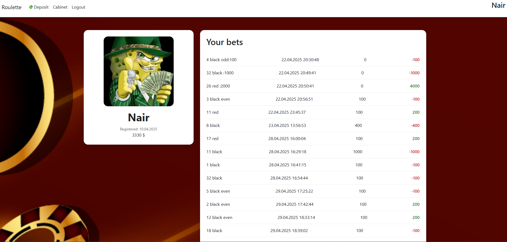
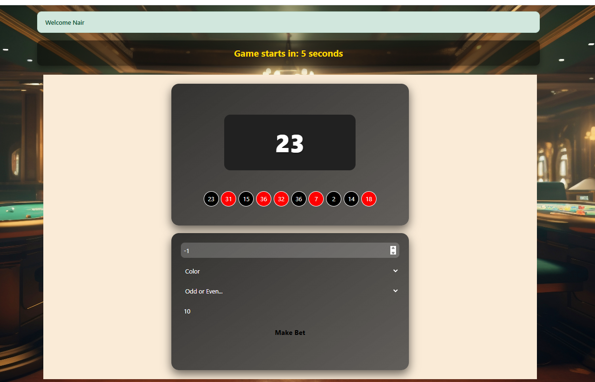

 # Casino Roulette 

This is a web-based casino application built with **ASP.NET MVC (Server-Side Rendering)** and **MSSQL**. The project provides user registration, profiles, betting history, and a playable roulette page.

---

## Tech Stack

- **Backend:** ASP.NET MVC (C#)  
- **Database:** MSSQL  
- **Frontend:** Razor Pages (SSR), HTML/CSS, JavaScript  
- **Other tools:** Bootstrap 5, Fetch API (AJAX)  

---

## Features

1. **User Registration and Login**  
   - Create and manage accounts  
   - Store registration date and profile information  

2. **User Profile**  
   - Display avatar and nickname  
   - Show registration date  
   - View betting history  

3. **Betting History**  
   - Record all bets made by the user  
   - Display number, color, amount, and result  
   - Highlight wins and losses  

4. **Roulette Game Page**  
   - Place bets on number, color, or odd/even  
   - Real-time countdown for the next spin  
   - Display the winning number and color  
   - Show live history of previous roulette results  

---
